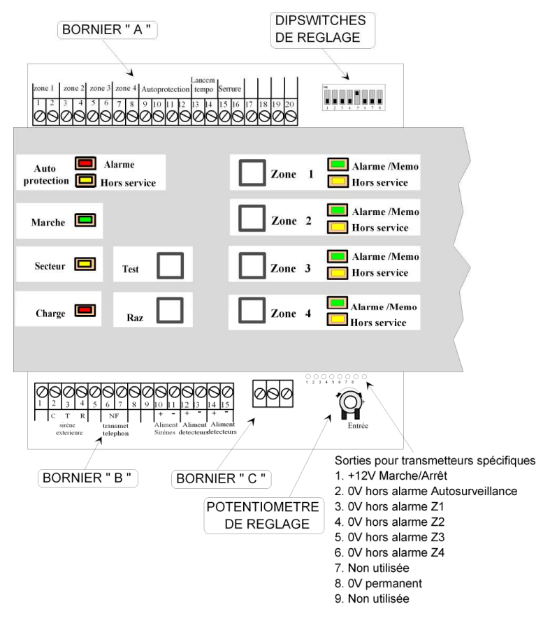

# Noxalarm NX640

Lien vers [Doc technique](assets/NX_640.pdf).

## Switch de réglage

| Switch | Usage |
| ---- 	| ----- |
| 4 | Serrure poussoir ou commutateur |
| 8 | Réarmement du système après défaut prolongé d'autoprotection |

