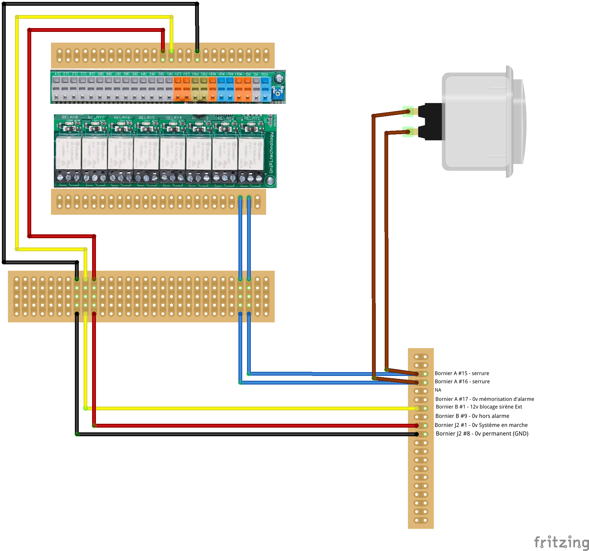

# UniPi / Evok

## Evok

[Evok REST API](https://github.com/UniPiTechnology/evok) is used to interract with IO ports of UniPi

Evok is running as a service. Available commands:

	sudo service evok status
	sudo service evok restart

For Home_Alarm software, Evok is configured to listen on localhost port 81.
This specific conf is saved here: `~/Prod/home_alarm/etc/nginx/evok`

## Hardware

### Configuration for Home Alarm

set jumpers JP2 and JP5 (digital inputs bind to external GND: I05 to I14)

### Digital inputs Configuration

Spec: 0 to 24V.
Wiring: see https://www.unipi.technology/tutorial/using-digital-inputs-unipi-1-74

Inputs are bind with Unipi GND. Two "12v out" connectors provide HIGH state. Then it is possible to read the state of an open/closed contact.

If an external HIGH state is used, then the ground of the input must be bind to the external LOW/GND (external power GND). To use this kind of conf, JP2 must be set, then JP3/JP4/JP5 must be configured as follow:

| Jumper | Reference GND connected to | Available inputs with ext power | conf for Home_Alarm |
| --- | --- | --- | --- |
| JP2 |  | P02 connected to 12v | ON |
| JP3 |  (gnd bind P02) | I01 and I02 | ON |
| JP4 |  (gnd bind P01) | I03 and I04 |  |
| JP5 |  (gnd bind P01) | I05 to I14 |  |

### Wiring

[Link to spec](https://docs.google.com/spreadsheets/d/1RaHXQrbrQtOYtAt50msUVF0jNxm5ZbKjP8GU0-2J8aQ/edit#gid=658993087)

| NoxAlarm | Couleur cable | Unipi | HomeAlarm | in inverse | out pulse |
| --- | --- | --- | --- | --- | --- |
| bornier A #15 - serrure | bleu | R1 Relay Output | out_power |  | TRUE |
| bornier A #16 - serrure | bleu | R1 Relay Output | out_power |  | TRUE |
| bornier B #1 - 12v blocage sirène Ext | jaune | I01 Digital Input  (gnd bind P02) | in_alert | TRUE |  |
| connecteur J2 #1 - 0v Système en marche | rouge | I02 Digital Input  (gnd bind P02) | in_power | TRUE |  |
| connecteur J2 #8 - 0v permanent (GND) | noir | P02 Configurable port |  |  |  |

